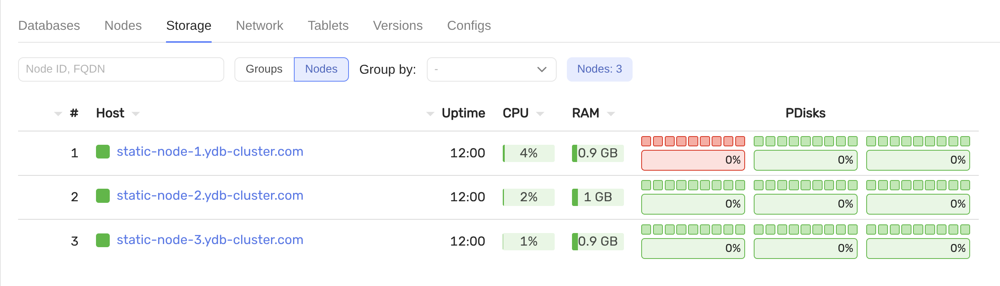
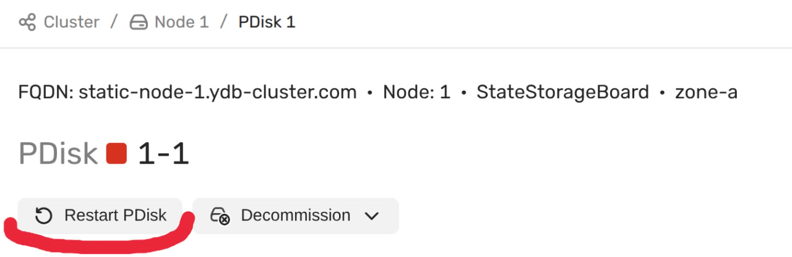
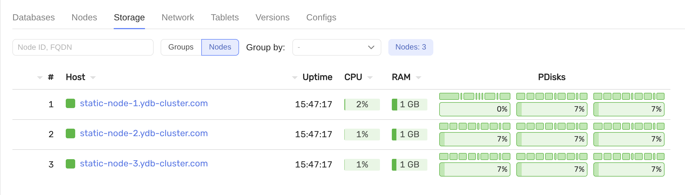

# Replace hard drive

## Requirements
- preinstalled cluster with `3-nodes-mirror-3-dc` configuration
- a failed drive on one or more servers (in this example `/dev/vdb` labelled as `ydb_disk_1` on `static-node-1.ydb-cluster.com`)

## Steps
1. Check that the disk is not working in monitoring

2. Manually replace the disk
3. Prepare the replaced disk `ansible-playbook ydb_platform.ydb.prepare_drives -l static-node-1.ydb-cluster.com --extra-vars "ydb_disk_prepare=ydb_disk_1`
4. Restart the broken disk through the monitoring UI

5. Check that the disk is working in the monitoring UI

