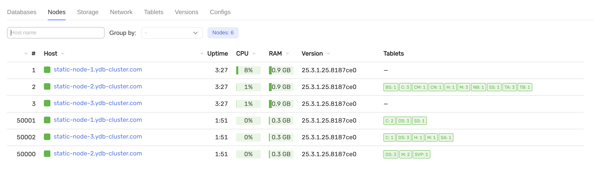
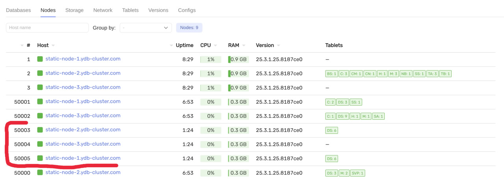

# Add dynamic node instance

## Requirements

- preinstalled cluster with `3-nodes-mirror-3-dc` configuration
- existing dynamic nodes running (in this example instances `a` are running and `b` will be added)


## Steps
1. Update `inventory/50-inventory.yaml` and add a new entry to the `ydb_dynnodes` variable with a new instance name and offset:
    ```yaml
      ydb_dynnodes:
        - { instance: 'a', offset: 1 }
        - { instance: 'b', offset: 2 }  # should be added
    ```

2. Deploy the new dynamic node instance on all hosts `ansible-playbook ydb_platform.ydb.install_dynamic --skip-tags password,create_database` and check that the new instance is running in monitoring UI


3. Check cluster health `ansible-playbook ydb_platform.ydb.healthcheck`

## Alternative: add dynamic nodes without updating inventory

Pass `ydb_dynnodes` directly via `--extra-vars` to avoid editing the inventory file:
```bash
ansible-playbook ydb_platform.ydb.install_dynamic \
  --skip-tags password,create_database \
  --extra-vars '{
    "ydb_dynnodes": [
      {"instance": "a", "offset": 1, "dbname": "database"},
      {"instance": "b", "offset": 2, "dbname": "database"}
    ]}'
  # -l static-node-1.ydb-cluster.com  # for a specific host
```

## Alternative: add a dynamic node and create a new database at the same time

To add a dynamic node instance for a new database `database2`:
```bash
ansible-playbook ydb_platform.ydb.install_dynamic \
  --extra-vars '{
    "ydb_dynnodes": [{"instance": "c", "offset": 3, "dbname": "database2"}],
    "ydb_dbname": "db2"}' \
  # -l static-node-1.ydb-cluster.com  # for a specific host
```
